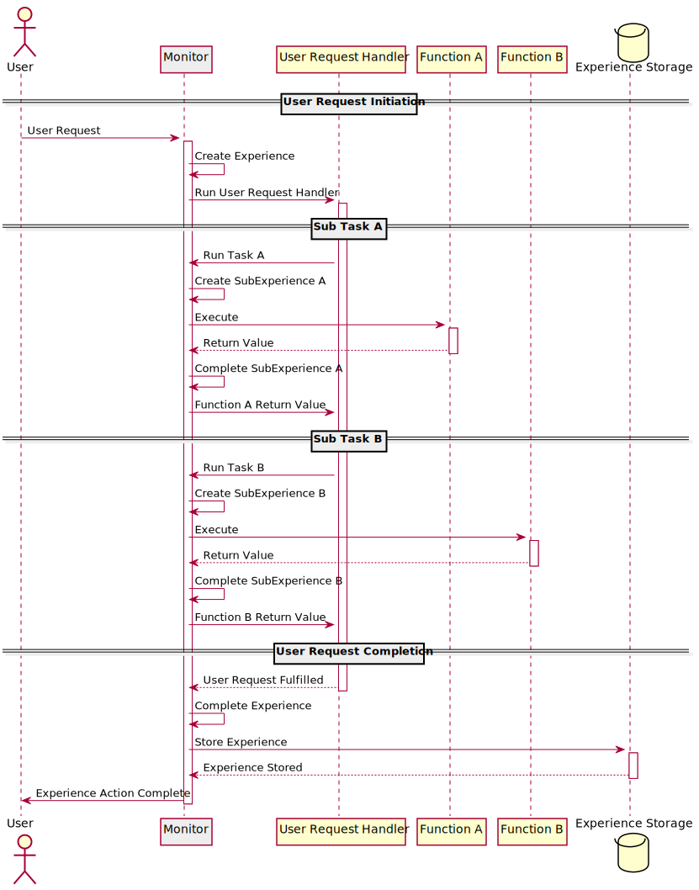

# Experience Monitor

Experience monitor records user experience. Once experience is started, experience monitor intercepts
tracked function calls using Proxy and wrapper functions. It can also send experience from one execution
space to the other using wrappers around message handler function. Such functions invisibly attaches
an experience object to the message and detaches it once it arrives to the destination.

## Sequence diagram

